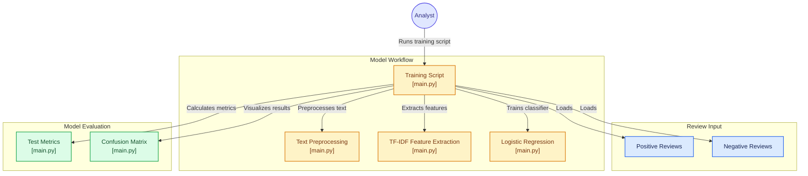

# Movies Sentiment Analysis 
### Natural Language Processing

## Movie Sentiment Analysis Workflow

```mermaid
flowchart TD
    subgraph group_input["Review Input"]
        node_positive["Positive Reviews"]
        node_negative["Negative Reviews"]
    end

    subgraph group_model["Model Workflow"]
        node_script["Training Script<br/>[main.py]"]
        node_preprocess["Text Preprocessing<br/>[main.py]"]
        node_vectorize["TF-IDF Feature Extraction<br/>[main.py]"]
        node_classifier["Logistic Regression<br/>[main.py]"]
    end

    subgraph group_results["Model Evaluation"]
        node_metrics["Test Metrics<br/>[main.py]"]
        node_confusion["Confusion Matrix<br/>[main.py]"]
    end

    node_user(("Analyst"))

    node_user -->|"Runs training script"| node_script
    node_script -->|"Loads"| node_positive
    node_script -->|"Loads"| node_negative
    node_script -->|"Preprocesses text"| node_preprocess
    node_script -->|"Extracts features"| node_vectorize
    node_script -->|"Trains classifier"| node_classifier
    node_script -->|"Calculates metrics"| node_metrics
    node_script -->|"Visualizes results"| node_confusion

    click node_script "https://github.com/yassakamille/movies_sentiment_analysis/blob/main/Implementation/Movies_seniment_Analysis/main.py"
    click node_positive "https://github.com/yassakamille/movies_sentiment_analysis/tree/main/Implementation/Movies_seniment_Analysis/positive"
    click node_negative "https://github.com/yassakamille/movies_sentiment_analysis/tree/main/Implementation/Movies_seniment_Analysis/negative"
    click node_preprocess "https://github.com/yassakamille/movies_sentiment_analysis/blob/main/Implementation/Movies_seniment_Analysis/main.py"
    click node_vectorize "https://github.com/yassakamille/movies_sentiment_analysis/blob/main/Implementation/Movies_seniment_Analysis/main.py"
    click node_classifier "https://github.com/yassakamille/movies_sentiment_analysis/blob/main/Implementation/Movies_seniment_Analysis/main.py"
    click node_metrics "https://github.com/yassakamille/movies_sentiment_analysis/blob/main/Implementation/Movies_seniment_Analysis/main.py"
    click node_confusion "https://github.com/yassakamille/movies_sentiment_analysis/blob/main/Implementation/Movies_seniment_Analysis/main.py"

    classDef toneNeutral fill:#f8fafc,stroke:#334155,stroke-width:1.5px,color:#0f172a
    classDef toneBlue fill:#dbeafe,stroke:#2563eb,stroke-width:1.5px,color:#172554
    classDef toneAmber fill:#fef3c7,stroke:#d97706,stroke-width:1.5px,color:#78350f
    classDef toneMint fill:#dcfce7,stroke:#16a34a,stroke-width:1.5px,color:#14532d
    classDef toneRose fill:#ffe4e6,stroke:#e11d48,stroke-width:1.5px,color:#881337
    classDef toneIndigo fill:#e0e7ff,stroke:#4f46e5,stroke-width:1.5px,color:#312e81
    classDef toneTeal fill:#ccfbf1,stroke:#0f766e,stroke-width:1.5px,color:#134e4a

    class node_positive,node_negative toneBlue
    class node_script,node_preprocess,node_vectorize,node_classifier toneAmber
    class node_metrics,node_confusion toneMint
    class node_user toneIndigo
```

